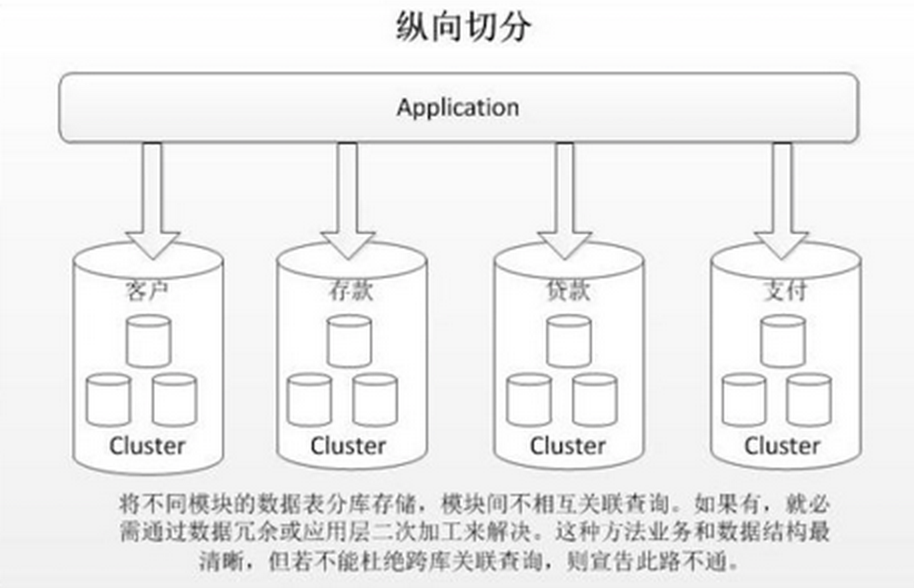
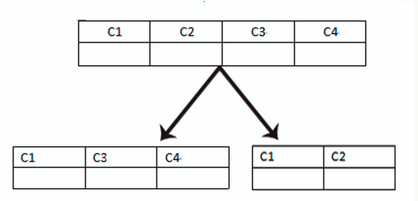
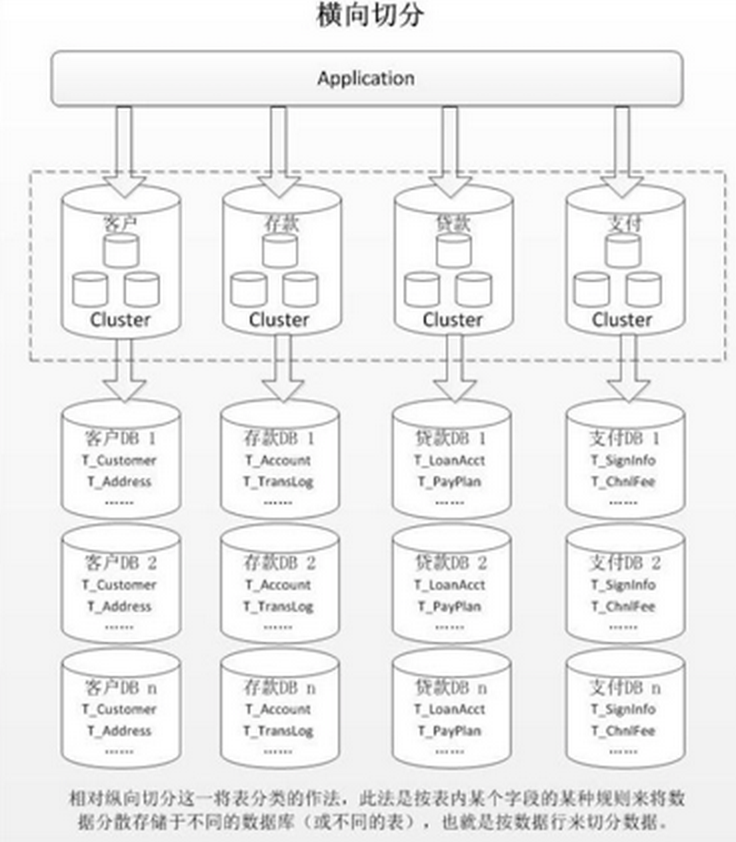

## 数据库知识总结
1. 事务
    >事务是作为单独的逻辑工作单元执行的一系列操作，要么所有的操作都执行成功，要么失败回滚。只有当事务内所有的操作都执行成功，才会更新数据库，否则不会更新数据库。事务是数据库运行中的逻辑工作单位。(begin,......,commit)

    事务的4个属性(ACID):   
    * 原子性：事务包含的操作，要么全部成功，要么全部失败，如果完全成功就应用到数据库上，如果失败就不能对数据库有任何的影响。
    * 一致性：事务必须使数据库从一个一致性性状态变换到另一个一致性状态，也就是事务执行前和执行后都必须处于一致状态。(比如银行转账)
    * 隔离性：多个用户访问数据库的时候，数据库为每一个用户都开启一个事务，这些事务不能被其他的事务的操作干扰。多个并发的事务之前必须是相互隔离的。(并发事务所做的修改必须与其他事务所做的修改隔离)
    * 持久性：一个事务一旦提交了，对数据库的改变是永久性的，即使数据库故障也不会丢失事务的操作。

2. 数据库并发会引起的问题
    * 脏读：在一个事务的处理中读取到了另外一个提交事务的数据，而另外一个事务有可能会因为失败回滚，这样就会造成错误。
    * 不可重复读：指在一个事务中，对于数据库中的数据，多次查询返回的结果不同。比如在T1执行的过程中，T2对数据进行了修改并且执行成功提交到了数据库。
    * 幻读(虚读)：比如T1对数据库中的某一列数据就行修改，在修改的期间T2插入了又一行数据，T1查看刚才的修改会发现还有一行没有修改。

3. 事务的隔离等级。
    * read uncommit(未提交读):隔离级别最低，可以被读取到未提交的数据，会出现脏读、不可重复读、幻读。
    * read commit(提交读)：事务提交之后更新的结果才能被其他事务看见。可以解决脏读，会出现不可重复读、幻读。
    * repeat read(可重复读):在事务中，对一份数据的读取结果总是相同(旧数据的结果),无论是否有其他事务对数据就行了修改。解决脏读、可重复读，会出现幻读。
    * serializable(可串行化)：事务串行执行，隔离级别最高，牺牲了系统的并发性。解决了幻读。
    * set tx_isolation = 'SERIALIZABLE' 
 
4. 第一范式、第二范式、第三范式
    * 第一范式：关系模式R的所有属性不能再分解为更基本的数据单位，属性不可再分，即满足第一范式，确保每一行的原子性。比如联系方式，又可以分为QQ、微信、手机号等等。
    * 第二范式：在满足第一范式的基础上，要求每个表必须要有主键，非主键列必须完全依赖于主键。比如如果主键有两列，其他的非主键列必须完全依赖于这两列主键，而不能只依赖其中一个主键。比如一个订单表中有两个主键，订单ID、商品ID，而商品的价格、折扣这些只依赖商品ID和订单ID没有关系，所有这样就不满足第二范式。
    * 第三范式：在满足第一、第二范式的基础上，要求所有的非主键列必须直接依赖于主键列，而不能间接依赖于主键列。比如考虑一个订单表，表中有数据：订单ID、订单数据、客户ID、客户姓名、地址等，主键为订单ID，客户的姓名、地址等是通过依赖客户ID间接依赖订单ID的，不是直接依赖订单ID，这样就不满足第三范式。不能存在依赖的传递关系。
    * 一般数据库在设计时满足到第三范式。

4. 数据库查询优化。
    
    1. 数据库设计的时候:
        * 避免全盘的扫描的，在where和order by涉及的列上建立索引。
        * 尽量避免表中有null值，可以把null设置为0，因为在where子句中对null值进行判断，会放弃索引而进行全盘扫描
        * 并不是所有的索引都对查询有效，当数据库中有大量数据重复是，索引也会有大量的重复，这时查询就可能不会利用索引。
        * 索引并不是越多越好，索引虽然提高了查询的速率，但同时也降低了insert和update的速率，因为insert和update的时候可能会重建索引。一般的话一个表不要超过6个(最多16个)，要考虑索引是否有必要
        * 尽量避免更新索引列，对索引的更新会从新调整索引列，耗费资源。对一个索引列需要频繁的更新的时候，就要考虑是否要把他作为索引。
        * 尽量的使用数字型字段，若只含数值信息的字段尽量不要设置成字符型，这样会降低查询和连接的性能，并且会增加存储的开销。字符型在查询的时候会一个个的字符比对，数字型比较一次
        * 使用varchar代替char，因为可变字段存储空间小，可以节省存储空间，在查询的时候，在一段相对较小的字段内搜索效率会更高。
        * 尽量使用表变量代替临时表。临时表不是不可以使用，要适当的使用，比如需要重复引用大型表或常用表中的某个数据集的时候，对于一次性事件，最好使用表变量。
        * 避免频繁的创建和删除临时表，减少系统表资源的消耗。如果使用到了临时表，在存储过程的最后务必将所有的临时表显式删除，先 truncate table，然后 drop table，这样可以避免系统表的较长时间锁定。
    2. sql语句方面:
        * 避免在where子句中使用!=、><，这样会导致全盘扫描，放弃索引。
        * where name like ‘%abc%’ 这样也会导致全盘扫描。
        * 如果在 where 子句中使用参数，也会导致全表扫描。因为SQL只有在运行时才会解析局部变量，但优化程序不能将访问计划的选择推迟到运行时；它必须在编译时进行选择。然而，如果在编译时建立访问计划，变量的值还是未知的，因而无法作为索引选择的输入项
        * 不要在 where 子句中的“=”左边进行函数、算术运算或其他表达式运算，否则系统将可能无法正确使用索引.如： select id from t where num/2=100,应改为：select id from t where num=100*2
        * 用 exists 代替 in 是一个好的选择：select num from a where num in(select num from b) 用下面的语句替换： select num from a where exists(select num from b where num=a.num)
        * 不要使用 select * from t ，用具体的字段列表代替“*”，不要返回用不到的任何字段.
        * 尽量避免使用游标，因为游标的效率较差，如果游标操作的数据超过1万行，那么就应该考虑改写。
        * 尽量避免向客户端返回大数据量，若数据量过大，应该考虑相应需求是否合理。
        * 尽量避免大事务操作，提高系统并发能力.  
5. 表变量和临时表
    * 表变量：存储在内存中，作用域是脚本的执行过程中，脚本执行完毕之后就会释放内存，适合短时间内存储数据量小的数据集。使用灵活，使用完之后立即释放，不占用物理存储空间，只适合较小数据量的暂时存储，不能建索引，数据量稍大时查询效率慢，占内存。
    * 临时表是存储在物理硬盘中的，建表位置在tempdb库中， 可以长久存储数据,可以建立索引，和普通的物理表一样，能存储大量数据,不方便使用，使用完之后要手动的drop,不然就会一直存在（此次连接关闭后就没了）
    * 使用临时表和表变量的数据量大小没有具体的临界值，DBA建议1000条数据，查询列不要太多的情况下。

6. 数据库索引
    * 数据库索引一般是B树或者B+树，保存在磁盘中，每一个磁盘页是一个节点，使用b树和b+树作为索引是因为，相同节点的情况下，b树和b+树的高度要低的多，访问磁盘的次数就会少，而磁盘io会花费大量的时间，这样可以节省时间，很快的找到数据所在的位置。
    * b+树比b树高效在于，b+树的中间节点不保存数据，而b树的中间节点会保存数据，消耗会大一些。同样大小的磁盘页中可以容纳更多的b+树的节点，磁盘IO的次数也会少一些。b+树的数据保存在叶子节点中，每次都要查询到叶子节点，性能稳定；B+的叶子节点都有指向相邻节点的指针，而且叶子节点的数据是按着从大到小的顺序排列的，所在执行范围查询的时候，B+树只要开始和结束的位置，然后直接在叶子节点中遍历就可以了，而B树则需要找到开始的位置不断的进行中序遍历输出，直到找到结束的位置。
    * 聚簇索引和非聚簇索引：聚簇索引一般是以主键建立的索引，行数据和索引是连在一起的，而非聚簇索引在非主键列上建立的索引，存放的是数据的地址，对非聚簇索引的查询是得到主键的位置然后在去聚簇索引中查询得到数据所在的地址。
    * 覆盖索引：覆盖索引中不仅保存的有主键的数据，还保存有数据行在数据库中的位置。
    * 一级索引和二级索引：一级索引就是聚簇索引，以主键列建立的索引，二级索引就是我们自己创建的索引，非主键列创建。
    * 全文索引：一般是对text或varchar中建立，以文章中的关键为节点，保存文章中关键字所在的数据行的位置。

7. 如何创建索引

7. 水平切分和垂直切分。
    * 垂直切分：垂直切分常见有垂直分库和垂直分表两种。 
                                                   
    * 垂直分库就是根据业务耦合性，将关联度低的不同表存储在不同的数据库。做法与大系统拆分为多个小系统类似，按业务分类进行独立划分。与"微服务治理"的做法相似，每个微服务使用单独的一个数据库。
    
    * 垂直分表是基于数据库中的"列"进行，某个表字段较多，可以新建一张扩展表，将不经常用或字段长度较大的字段拆分出去到扩展表中。在字段很多的情况下（例如一个大表有100多个字段），通过"大表拆小表"，更便于开发与维护，也能避免跨页问题，MySQL底层是通过数据页存储的，一条记录占用空间过大会导致跨页，造成额外的性能开销。另外数据库以行为单位将数据加载到内存中，这样表中字段长度较短且访问频率较高，内存能加载更多的数据，命中率更高，减少了磁盘IO，从而提升了数据库性能。
    * 优点：解决业务系统层面的耦合，业务清晰；与微服务的治理类似，也能对不同业务的数据进行分级管理、维护、监控、扩展等；高并发场景下，垂直切分一定程度的提升IO、数据库连接数、单机硬件资源的瓶颈
    * 缺点：部分表无法join，只能通过接口聚合方式解决，提升了开发的复杂度;分布式事务处理复杂;依然存在单表数据量过大的问题（需要水平切分）;
    
    * 水平切分：当一个应用难以再细粒度的垂直切分，或切分后数据量行数巨大，存在单库读写、存储性能瓶颈，这时候就需要进行水平切分了。水平切分分为库内分表和分库分表，是根据表内数据内在的逻辑关系，将同一个表按不同的条件分散到多个数据库或多个表中，每个表中只包含一部分数据，从而使得单个表的数据量变小，达到分布式的效果。库内分表只解决了单一表数据量过大的问题，但没有将表分布到不同机器的库上，因此对于减轻MySQL数据库的压力来说，帮助不是很大，大家还是竞争同一个物理机的CPU、内存、网络IO，最好通过分库分表来解决。
    * 优点：不存在单库数据量过大、高并发的性能瓶颈，提升系统稳定性和负载能力;应用端改造较小，不需要拆分业务模块;
    * 缺点:跨分片的事务一致性难以保证;跨库的join关联查询性能较差数据多次扩展难度和维护量极大
    * 几种数据分片的规则：
    1. 根据数值范围,按照时间区间或ID区间来切分。例如：按日期将不同月甚至是日的数据分散到不同的库中；将userId为1-9999的记录分到第一个库，10000-20000的分到第二个库，以此类推。
    这样的优点在于：单表大小可控;天然便于水平扩展，后期如果想对整个分片集群扩容时，只需要添加节点即可，无需对其他分片的数据进行迁移;使用分片字段进行范围查找时，连续分片可快速定位分片进行快速查询，有效避免跨分片查询的问题。
    缺点：热点数据成为性能瓶颈。连续分片可能存在数据热点，例如按时间字段分片，有些分片存储最近时间段内的数据，可能会被频繁的读写，而有些分片存储的历史数据，则很少被查询;
    2. 根据数值取模,一般采用hash取模mod的切分方式，例如：将 Customer 表根据 cusno 字段切分到4个库中，余数为0的放到第一个库，余数为1的放到第二个库，以此类推。这样同一个用户的数据会分散到同一个库中，如果查询条件带有cusno字段，则可明确定位到相应库去查询。
    * 优点：数据分片相对比较均匀，不容易出现热点和并发访问的瓶颈
    * 缺点：后期分片集群扩容时，需要迁移旧的数据（使用一致性hash算法能较好的避免这个问题）;容易面临跨分片查询的复杂问题。比如上例中，如果频繁用到的查询条件中不带cusno时，将会导致无法定位数据库，从而需要同时向4个库发起查询，再在内存中合并数据，取最小集返回给应用，分库反而成为拖累。
    * 什么时候考虑切分
    1. 数据量过大，正常运维影响业务访问,对数据库备份，如果单表太大，备份时需要大量的磁盘IO和网络IO。一次运维需要很长的时间
    2. 随着业务发展，需要对某些字段垂直拆分.当业务快速发展时，用户量从10w激增到10亿，用户非常的活跃，每次登录会更新 last_login_name 字段，使得 user 表被不断update，压力很大。而其他字段：id, name, personal_info 是不变的或很少更新的，此时在业务角度，就要将 last_login_time 拆分出去，新建一个 user_time 表。
    3. 数据量快速增长;随着业务的快速发展，单表中的数据量会持续增长，当性能接近瓶颈时，就需要考虑水平切分，做分库分表了。此时一定要选择合适的切分规则，提前预估好数据容量
    4. 安全性和可用性;鸡蛋不要放在一个篮子里。在业务层面上垂直切分，将不相关的业务的数据库分隔，因为每个业务的数据量、访问量都不同，不能因为一个业务把数据库搞挂而牵连到其他业务。利用水平切分，当一个数据库出现问题时，不会影响到100%的用户，每个库只承担业务的一部分数据，这样整体的可用性就能提高。

8. 分库分表带来的问题
    * 事务一致性问题
    >分布式事务,当更新内容同时分布在不同库中，不可避免会带来跨库事务问题。分布式事务能最大限度保证了数据库操作的原子性。但在提交事务时需要协调多个节点，推后了提交事务的时间点，延长了事务的执行时间。导致事务在访问共享资源时发生冲突或死锁的概率增高。随着数据库节点的增多，这种趋势会越来越严重，从而成为系统在数据库层面上水平扩展的枷锁。 
    * 跨节点关联查询 join 问题
    >切分之前，系统中很多列表和详情页所需的数据可以通过sql join来完成。而切分之后，数据可能分布在不同的节点上，此时join带来的问题就比较麻烦了，考虑到性能，尽量避免使用join查询。
    * 解决方法
    >在系统层面，分两次查询，第一次查询的结果集中找出关联数据id，然后根据id发起第二次请求得到关联数据。最后将获得到的数据进行字段拼装。
    * 全局主键避重问题
    >在分库分表环境中，由于表中数据同时存在不同数据库中，主键值平时使用的自增长将无用武之地，某个分区数据库自生成的ID无法保证全局唯一。因此需要单独设计全局主键，以避免跨库主键重复问题。
    * 数据迁移、扩容问题
    >当业务高速发展，面临性能和存储的瓶颈时，才会考虑分片设计，此时就不可避免的需要考虑历史数据迁移的问题。一般做法是先读出历史数据，然后按指定的分片规则再将数据写入到各个分片节点中。此外还需要根据当前的数据量和QPS，以及业务发展的速度，进行容量规划，推算出大概需要多少分片。如果采用数值范围分片，只需要添加节点就可以进行扩容了，不需要对分片数据迁移。如果采用的是数值取模分片，则考虑后期的扩容问题就相对比较麻烦。

9. 数据库读写分离
    * 在访问数据库的请求中，基本上都是对数据库进行读操作，只有很少量的写操作请求，所以可以通过设置主从数据库实现读写分离，主数据库执行写操作，从数据库执行读操作(会被动的执行写操作，因为要保持数据同步)，通过主从同步机制现实主从数据库的同步。
    * 主从同步机制：Mysql服务器之间的主从同步是基于二进制日志机制，主服务器使用二进制日志来记录数据库的变动情况，从服务器通过读取和执行该日志文件来保持和主服务器的数据一致。在使用二进制日志时，主服务器的所有操作都会被记录下来，然后从服务器会接收到该日志的一个副本。从服务器可以指定执行该日志中的哪一类事件（譬如只插入数据或者只更新数据），默认会执行日志中的所有语句。每一个从服务器会记录关于二进制日志的信息：文件名和已经处理过的语句，这样意味着不同的从服务器可以分别执行同一个二进制日志的不同部分，并且从服务器可以随时连接或者中断和主服务器的连接。主服务器和每一个从服务器都必须配置一个唯一的ID号（在my.cnf文件的mysqld模块下有一个server-id配置项），另外，每一个从服务器还需要通过CHANGE MASTER TO语句来配置它要连接的主服务器的ip地址，日志文件名称和该日志里面的位置（这些信息存储在主服务器的数据库里）

10. 主从复制的原理和方式
    * 主库会生成一个log dump线程向从库的io线程传递binlog；从库会用两个线程，一个io线程，一个sql线程，io线程负责请求主库的binlog并写入到relay log文件中，sql线程会读取relay log中的日志，并解析成具体操作，这样来实现主从一致，而最终数据一致。
    * 主从复制的方式：异步复制，最普通的模式，主数据库写完成之后log dump才会向io线程传递binlog；半同步复制，主数据库操作完成之后，调用log dump向从数据库传递binlog，log dump进入waitack状态，从数据库进行读取解析binlog，然后进行同步，同步完成之后唤醒log dump线程，log dump线程唤醒主库写线程，主库写操作完成；并行复制，通过多线程，多个线程获取binlog，多个线程执行binlog。

10. 行锁，间隙锁，next-key锁
    >InnoDB行锁是通过给索引上的索引项加锁来实现的， 只有通过索引条件检索数据，InnoDB才使用行级锁，否则，InnoDB将使用表锁。任何辅助索引上的锁，或者非索引列上的锁，最终都要回溯到主键上，在主键上也要加一把锁。
    * 行锁：锁定一行
    * 间隙锁：配合主索引，对于一段间隙进行加锁(可以包含几行，也可以就是相邻两行之间的间隙)，防止数据插入，可以解决幻读。
    * next-key:包含行锁和间隙锁，锁定一段范围
    * S锁(共享锁),读锁；X锁(排他锁)，写锁。

11. 悲观锁和乐观锁
    * 乐观锁和悲观锁是一种机制不是指具体的锁。
    >悲观锁（Pessimistic Lock），顾名思义，就是很悲观，每次去拿数据的时候都认为别人会修改，所以每次在拿数据的时候都会上锁，这样别人想拿这个数据就会block直到它解锁。

    >乐观锁（Optimistic Lock），顾名思义，就是很乐观，每次去拿数据的时候都认为别人不会修改，所以不会上锁，乐观锁适用于读多写少的应用场景，这样可以提高并发粒度。
    * 实现
    >悲观锁实现：事务隔离级别的可串行化就是典型的悲观锁机制，读加读锁，写加写锁。这是基于锁的并发控制。
    
    >乐观锁实现：innoDB引擎的乐观锁机制是通过MVCC实现的。MVCC即Multi-Version Concurrency Control，中文翻译过来叫多版本并发控制（读不加锁读写不冲突）。顾名思义MVCC是通过保存数据在某一个时间点的快照来实现的。因此每一个事务无论执行多长时间看到的数据，都是一样的。

12. MVCC
    * 多版本并发控制,要适用于Mysql的RC,RR隔离级别
    * 基本原理:MVCC的实现，通过保存数据在某个时间点的快照来实现的。这意味着一个事务无论运行多长时间，在同一个事务里能够看到数据一致的视图。根据事务开始的时间不同，同时也意味着在同一个时刻不同事务看到的相同表里的数据可能是不同的。
    * 基本特征:每行数据都存在一个版本，每次数据更新时都更新该版本。修改时Copy出当前版本随意修改，各个事务之间无干扰。保存时比较版本号，如果成功（commit），则覆盖原记录；失败则放弃copy（rollback）
    * InnoDB存储引擎MVCC的实现策略:
    1. 在每一行数据中额外保存两个隐藏的列：当前行创建时的版本号和删除时的版本号（可能为空，其实还有一列称为回滚指针，用于事务回滚，不在本文范畴）。这里的版本号并不是实际的时间值，而是系统版本号。每开始新的事务，系统版本号都会自动递增。事务开始时刻的系统版本号会作为事务的版本号，用来和查询每行记录的版本号进行比较。每个事务又有自己的版本号，这样事务内执行CRUD操作时，就通过版本号的比较来达到数据版本控制的目的。

    2. 每个事务都有自己的版本号，在创建和更新的时候，会把创建版本号设置为事务自己的版本号，更新、查询、删除都只能对(创建版本号<=当前版本号 && 删除版本号>当前版本号)的数据行进行处理。

13. MySQL的两种引擎，MyISAM和InnoDB
    * InnoDB支持事务,MyISAM不支持事务。InnoDB每一条SQL语言都默认封装成事务，自动提交，这样会影响速度，所以最好把多条SQL语言放在begin和commit之间，组成一个事务
    * InnoDB支持外键，而MyISAM不支持。对一个包含外键的InnoDB表转为MYISAM会失败
    * InnoDB支持行锁，粒度更小，并发性强，发生死锁的概率会高；MyISAM只支持表锁，并发性低，发生死锁的概率小。
    * InnoDB是聚集索引，数据文件是和索引绑在一起的，必须要有主键，通过主键索引效率很高。但是辅助索引需要两次查询，先查询到主键，然后再通过主键查询到数据。因此，主键不应该过大，因为主键太大，其他索引也都会很大；而MyISAM是非聚集索引，数据文件是分离的，索引保存的是数据文件的指针。主键索引和辅助索引是独立的。
    * InnoDB不保存表的具体行数，执行select count(*) from table时需要全表扫描。而MyISAM用一个变量保存了整个表的行数，执行上述语句时只需要读出该变量即可，速度很快；
    * Innodb不支持全文索引，而MyISAM支持全文索引，查询效率上MyISAM要高

14. 如何优化数据库性能。
    * 建立数据库的时候，建立索引....
    * sql语句方面优化...
    * 数据库配置方面：选用合适的数据引擎，加大物理内存，使用SSD固态硬盘，
    * 数据库架构方面：主从复制与读写分离；增加缓存，把热点数据缓存到内存中，本地缓存或者分布式缓存；分库，分表，分区；
    * 数据库维护方面：性能监控，性能分析，性能调优，数据库备份和恢复等。

15. 琐碎知识点:
    * MySQL默认端口：3306
